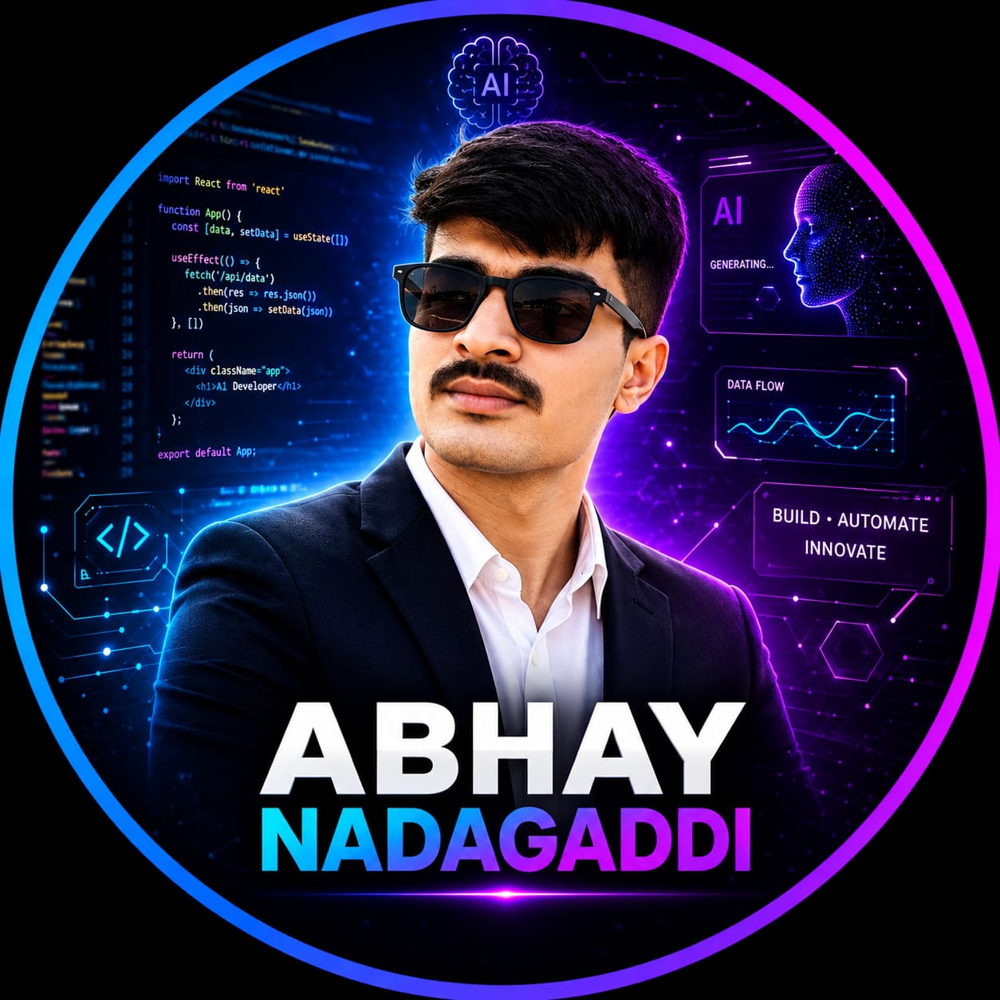

# 👋 Hello, I'm Abhay Nadagaddi

### Full Stack Developer | Software Engineer

**React • JavaScript • Node.js • Python**

I'm an engineering student at **KLE Technological University**.
I'm learning programming and computer science fundamentals while developing my full stack skills.

 

  

---

## 🎓 About Me

- 🎓 Engineering student at **KLE Technological University**.
- 💻 Developing my skills in **full stack web development**.
- 🌐 Frontend: **React, JavaScript, HTML, and CSS**.
- ⚙️ Backend: **Node.js, Express, and Python**.
- 🗄️ Databases: **MongoDB and MySQL**.
- 📚 Currently learning **C, C++, Java, Python, Data Structures, DBMS, and Operating Systems**.
- 🌍 Portfolio: [Visit my website](https://abhay-nadagaddi-portfolio.nabhay747.chatgpt.site).
- 📫 Email: **nabhay747@gmail.com**.

---

## ⚡ Technology Stack

### 🎨 Frontend

**React · JavaScript · HTML · CSS**

### ⚙️ Backend

**Node.js · Express · Python**

### 🗄️ Databases

**MongoDB · MySQL**

---

## 🚀 Portfolio Website

A personal website presenting my introduction, technology stack, learning interests, and contact information.

**Technologies:** HTML · CSS · JavaScript

### Features

- Responsive layout for desktop and mobile.
- Dark theme with purple–cyan gradients.
- Animated profile photo effects with a pause control.
- Technology category tabs.
- Contact form that opens an email draft.
- GitHub, LinkedIn, and email links.

**[🌐 View my portfolio](https://abhay-nadagaddi-portfolio.nabhay747.chatgpt.site)**

---

## 🌱 Currently Learning

| Area | Topics |
| :--- | :--- |
| Programming Languages | C, C++, Java, Python |
| Data Structures | Organizing and working with data |
| DBMS | Database management systems |
| Operating Systems | OS principles and programming |

---

## 💡 Developer Philosophy

> Keep learning, work hard, and never give up.

---

## 🤝 Let's Connect

- **Portfolio:** [Visit my website](https://abhay-nadagaddi-portfolio.nabhay747.chatgpt.site)
- **GitHub:** [Dydof](https://github.com/Dydof)
- **LinkedIn:** [Abhay Nadagaddi](https://www.linkedin.com/in/abhay-n-a15536263/)
- **Email:** [nabhay747@gmail.com](mailto:nabhay747@gmail.com)

